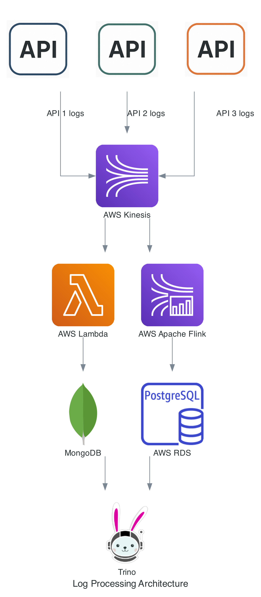

# Cloud-Native-Distributed-Large-Scale-Log-Processing-System

This project demonstrates a **cloud-native**, distributed real-time log analytics system built using fully managed services including **AWS Kinesis**, **AWS Lambda**, **Amazon RDS (PostgreSQL)**, **MongoDB Atlas**, and **Apache Flink Studio**. It also integrates **Trino** to enable cross-database federated analytics. The pipeline is designed for scalability, flexibility, and real-time observability of microservice logs.

---

## 🔧 Architecture Overview

 

---

## 📦 Components

### 1. **Log Generator (Python)**

Simulates real-time application logs in JSON format. Each log includes:

* `timestamp`
* `service` (e.g., auth, payment)
* `status` (HTTP code)
* `message`
* `latency_ms`

Logs are streamed into a **Kinesis Data Stream** hosted on AWS.

---

### 2. **AWS Kinesis Data Stream**

A fully managed, scalable AWS service used to capture real-time data streams. Logs are ingested into a stream called `log-stream`.

---

### 3. **AWS Lambda**

* Acts as a trigger-based consumer for the Kinesis stream.
* Automatically triggered to forward log events into MongoDB.
* Uses `pymongo` to connect to MongoDB Atlas over HTTPS.

---

### 4. **MongoDB Atlas**

* Cloud-hosted NoSQL database storing all **raw logs**.
* Used for real-time debugging, pattern tracking, and incident analysis.
* Queryable directly or via Trino.

---

### 5. **Apache Flink (AWS Kinesis Data Analytics Studio)**

* Cloud-hosted SQL-based stream processing engine.
* Reads from `log-stream` and performs:

  * Error aggregation
  * Latency calculations
  * Per-service metrics using time windows
* Outputs are pushed to PostgreSQL.

---

### 6. **Amazon RDS – PostgreSQL**

* Fully managed relational database hosted in the cloud.
* Stores structured analytics data:

  * `error_summary` table with:

    * Service name
    * Window start
    * Total errors
    * Average latency

---

### 7. **Trino (PrestoSQL)**

* Federated SQL engine that queries across both:

  * **MongoDB Atlas** (raw logs)
  * **Amazon RDS PostgreSQL** (analytics)
* Used to generate insights, dashboards, and reports.

---

## 🧪 Use Cases

* Real-time error tracking per microservice
* Per-minute latency and failure trends
* Federated analysis across raw logs + aggregates
* SQL-powered dashboards using Trino

---

## 💡 Cloud Technologies Used

| Service/Tool         | Role                                |
| -------------------- | ----------------------------------- |
| AWS Kinesis          | Real-time data stream               |
| AWS Lambda           | Kinesis event consumer (serverless) |
| AWS RDS - PostgreSQL | Structured analytics database       |
| MongoDB Atlas        | Cloud-native NoSQL document store   |
| Apache Flink Studio  | Streaming analytics engine          |
| Trino                | Federated SQL engine                |

---

## 🚀 Running the Pipeline

1. **Generate Logs** using the Python script
2. **Ingest Logs** into AWS Kinesis
3. **Lambda** processes records and inserts into MongoDB Atlas
4. **Flink Studio** processes streams and aggregates per window
5. **Aggregated data** is inserted into PostgreSQL via JDBC
6. **Trino** performs federated joins and exploratory analytics

---

## 📢 Contact

Built by Karan S
Questions or feedback? Reach out via https://www.linkedin.com/in/karan-shivareddy-545891199/
